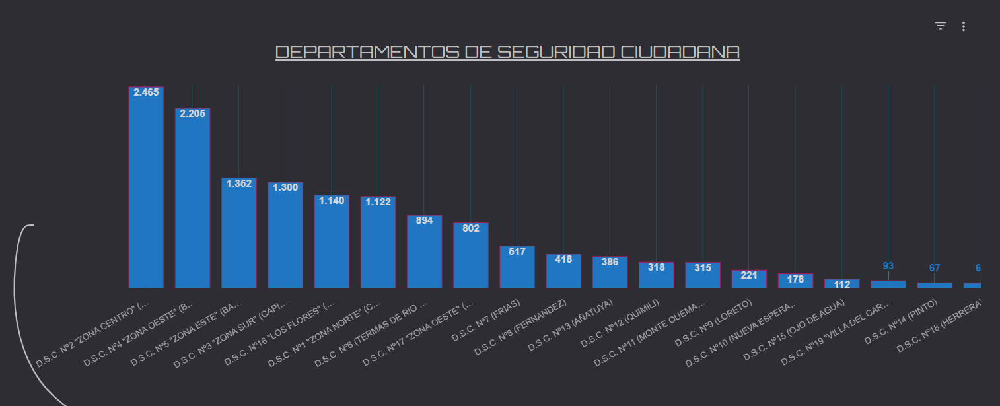
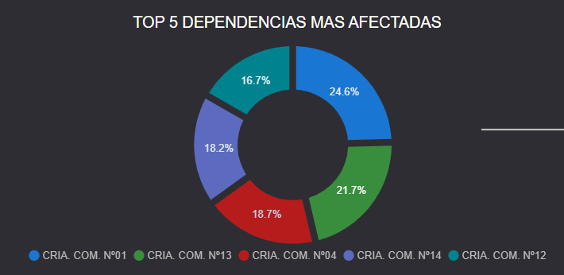

# 📘 Proyecto Final PP3: Análisis de Estadísticas Delictuales en SDE

**Tecnicatura en Ciencia de Datos e Inteligencia Artificial**
* **Grupo N° 1:** Cortez Maximiliano, Francavilla Fiorella y Nasif Victor
* **Institución:** Depto. Gestión de la Inf. Criminal (Policía de Santiago del Estero)
* **Tutor:** Mubarqui Elias
* **Año:** 2024-2025

---

## 🎯 2. Objetivo y Motivación
**El Problema:** La dependencia carecía de una herramienta unificada para el análisis en tiempo real. Los reportes manuales en Excel impedían un análisis global oportuno.
**La Solución:** Un "controlador digital" centralizado en **Looker Studio** para visualizar patrones, zonas calientes (hotspots) y horarios críticos.
**Impacto:** Facilitar la toma de decisiones basada en datos (*Data-Driven Decisions*) para optimizar el patrullaje y la prevención.

---

## 🧩 3. Alcance del Proyecto
Se implementó un dashboard que se conecta a un Google Sheet (alimentado por formularios y reportes de WhatsApp).
* **Se analiza:** 13.081 registros (Oct 2024 - Presente).
* **Tecnología:** Arquitectura 100% Cloud (Google Workspace).
* **Privacidad:** El dashboard no expone datos personales sensibles (nombres, DNI), solo estadísticas agregadas.

---

## ⚙️ 5. Metodología y Arquitectura
El flujo de datos sigue un proceso ETL simplificado:
1. **Ingesta:** Reporte vía WhatsApp -> Transcripción a Google Sheet (con Macros).
2. **Transformación:** Limpieza en Sheet y campos calculados en Looker Studio.
3. **Visualización:** Dashboard Interactivo.

### Diagrama de Flujo
`WhatsApp` ➡️ `Operador/Formulario` ➡️ `Google Sheet (BD)` ➡️ `Looker Studio` ➡️ `Usuario Final`

---

## 📊 7. Visualizaciones y Resultados

> *Nota: Las imágenes a continuación son ilustrativas del dashboard.*

### Top Localidades y Dependencias

* **Hallazgo:** La zona centro de Ciudad Capital es la más afectada, seguida por La Banda.

* **Dependencia:** La Comisaria Comunitaria N° 1 concentra el 24.6% de los delitos.

### Mapa de Calor (Hotspots)

### Conclusiones Clave
1. **Delito más frecuente:** Robo simple, seguido de hurto simple.
2. **Día crítico:** Lunes.
3. **Hora pico:** 18:00 a 00:00 hs.
---

## 💻 9. Documentación Técnica
Este proyecto no requiere instalación local ya que es **Serverless (Cloud)**.

* **Acceso:** El usuario final accede mediante enlace web.
* **Fuente de Datos:** Google Sheets.
* **Mantenimiento:** Actualización de campos desde "Gestionar fuentes de datos" en Looker Studio.

### Estructura del Repositorio
